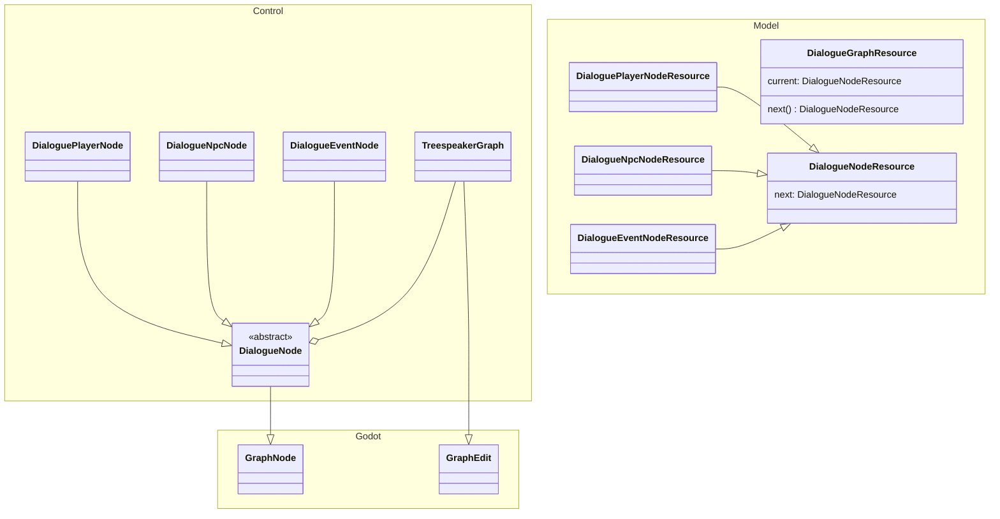

# TreeSpeak

⚠️ CAUTION: Work in progress. This plugin is missing core features and is not usable in its current state ⚠️

TreeSpeak is a dialogue graph plugin and editor for Godot 4. 

Created by Scanian Forest.

## Features

* Branching dialogues using GraphNodes and connections
* Affect the game world using DialogueEvents (add/remove items, receive/complete quests)

## Architectural overview

This sections outlines how the plugin is designed.

## Roadmap

This plugin will feature the following:

* A custom in-engine editor for designing dialogues
* A DialogueManager singleton to start dialogues using files (JSON) created in the custom editor.
* A DialogueChannel singleton, exposing signals so that your game systems can listen to and react to dialogue events.
* A basic UI framework to display the dialogues in-game
  * NPC and player portraits
  * Scrolling text
  * Selectable dialogue options

## Attributions

Plugin icon [Solid leaf](https://game-icons.net/1x1/delapouite/solid-leaf.html) created by [Delapouite](https://delapouite.com/) under [CC BY 3.0](https://creativecommons.org/licenses/by/3.0/)
